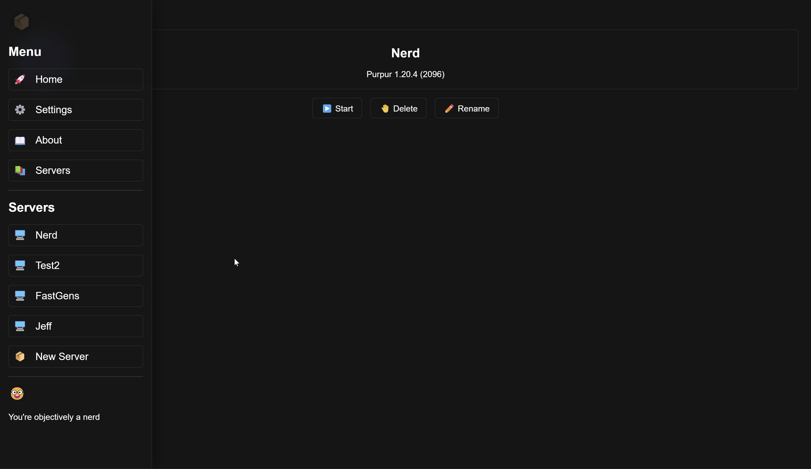

# 📦 Boxes Software `v0.1.x`

Like this project? Leave a ⭐ star on the repository!

> 📦 [Boxes](https://github.com/Azuyamat/boxes) for the CLI version.
> 
> 🪵 [Notch](https://github.com/Azuyamat/notch) for the Rust library.

## Description

Boxes is a software that allows you to manage your Minecraft servers with ease. It is currently in development and is not ready for production use.
In the meanwhile, you can still use it to manage your servers, but be aware that it is not stable and that it may break at any time.

## Installation

Not available yet.

## Usage

Not available yet.

## License

This product is available under the [MIT licence](https://opensource.org/licenses/MIT).
